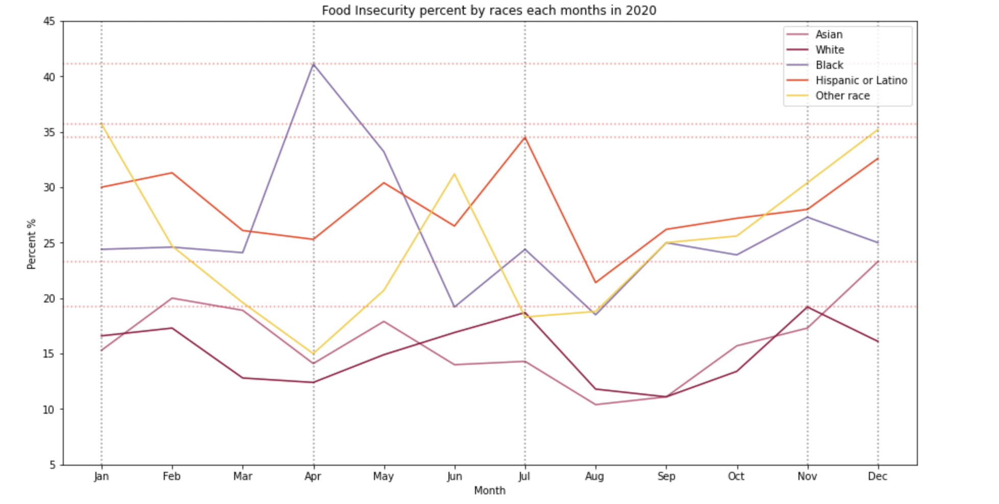
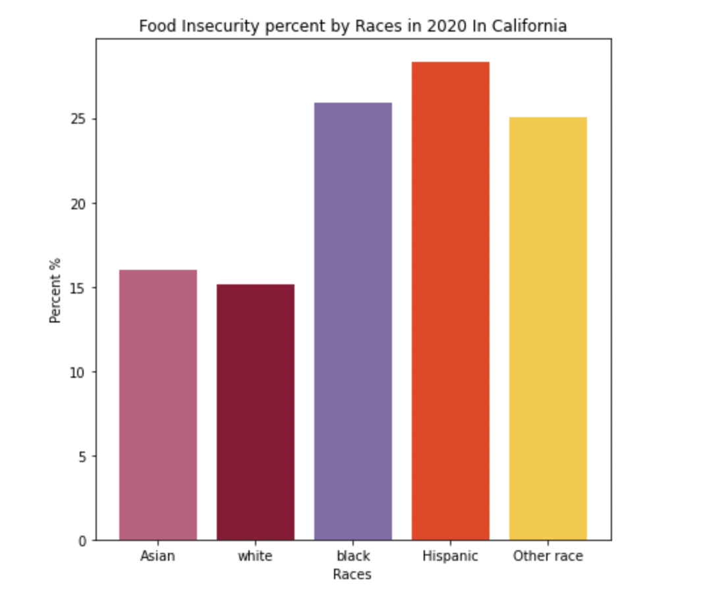
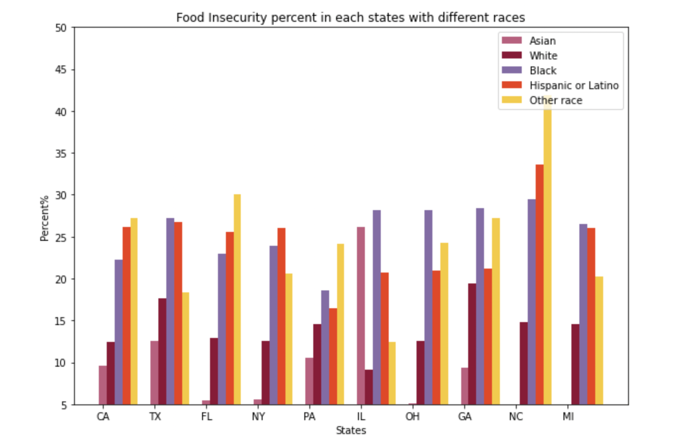

# ECE 143 Final Project
Food Insecurtiy 

# Authors
Tanvir Hussain 
Zehua Tang 
Haoyan Xin 
Lingxi Li 
Krystal Chan 

# Overview
Food security is a measure of an individual’s ability to access healthy and nutritious food; food insecurity or the lack of access to healthy food is a persistent issue around the globe. Society recognizes the problem of food insecurity yet it is unclear what are the significant factors. The cause of food insecurity is manifold. Social, political, and economical reasons are easy to identify, but the order of importance is often debated. With the unprecedented strike of COVID-19, food insecurity has become relevant now more than ever when lack of access to nutritional food has skyrocketed. With the bloom of big data, our ability to better understand the reasons behind food insecurity has been greatly enhanced. In our work, we wish to analyze and rank different factors that potentially contribute to food insecurity in order to strongly correlate food insecurity to relevant factors, and even offer possible solutions to some of the challenges. 

# Data source
We wish to use a combination of multiple datasets studying aspects of food insecurity. One such example is the United States Census Bureau's Pulse Survey. These datasets contain racial, ethnic, and geographical and socioeconomic status of respondents which can be correlated to their level of food security. There are also recent datasets regarding the impact of COVID-19 on food insecurity.

# Third party
panda 
numpy 
matplotlib.pyplot 

# Dataset description
"county food insercuity in CA.csv": dataset of the people have food insecurity problem for each county in California
https://map.feedingamerica.org/county/2018/overall/california

# Data Virtualization

 

